# OAuth2 License Server

A learning project for OAuth2 / OpenID Connect. Demonstrates the authorization code flow, JWT validation, and feature-flag-based licensing across three services, all running in Docker.



---

## How it works

1. A user visits the **frontend** and is redirected to **Keycloak** to log in.
2. Keycloak issues a signed JWT (access token) and redirects the user back.
3. The frontend calls the **license service** with that JWT as a Bearer token.
4. The license service validates the token cryptographically using Keycloak's public keys (JWKS) — no round-trip to Keycloak required.
5. The license service returns the list of features assigned to that user.
6. The frontend enables or disables UI elements based on the feature list.

The **admin UI** follows the same OAuth2 flow and uses the license service's admin endpoints to assign and revoke features per user.

---

## Project layout

```
license-project/
├── docker-compose.yml
├── keycloak/
│   └── realm-export.json          # pre-configured Keycloak realm
├── license-service/               # Go — JWT validation, feature CRUD
│   ├── Dockerfile
│   ├── go.mod
│   └── main.go
├── admin-ui/                      # Python / Flask — assign & revoke licenses
│   ├── Dockerfile
│   ├── requirements.txt
│   └── app.py
└── frontend/                      # Python / Flask — feature-flagged UI
    ├── Dockerfile
    ├── requirements.txt
    └── app.py
```
---
## Stack

| Component | Language | Notes |
|---|---|---|
| Identity Provider | Keycloak (Docker) | Skip building this yourself — learning OAuth2 as a client is the goal |
| License Service | Go | Simple REST API, good Go learning target |
| Admin UI | Python / Flask | Fast to build, lets you focus on the OAuth2 client flow |
| Frontend App | Python / Flask | Demonstrates token validation and feature flags |


---

## Services

| Service | Port | Language | Purpose |
|---|---|---|---|
| Keycloak | 8080 | — | Identity provider, issues JWTs |
| PostgreSQL | 5432 | — | Stores user → feature mappings |
| License service | 9000 | Go | Validates tokens, manages licenses |
| Admin UI | 5001 | Python / Flask | Assign and revoke features |
| Frontend | 5010 | Python / Flask | Feature-flagged user interface |

---

## Getting started

### Prerequisites

- Docker and Docker Compose

### 1. Start Keycloak and Postgres

```bash
docker-compose up keycloak postgres
```

Wait for Keycloak to be ready, then open [http://localhost:8080](http://localhost:8080).

### 2. Configure Keycloak

Log in to the admin console (`admin` / `admin`) and create a realm called `license-demo`.

Inside that realm, create two clients:

**`frontend`**
- Client authentication: on
- Authorization code flow: enabled
- Valid redirect URI: `http://localhost:5000/callback`

**`admin-ui`**
- Client authentication: on
- Authorization code flow: enabled
- Valid redirect URI: `http://localhost:5001/callback`

Create a test user and note their user ID (visible on the user detail page — it's a UUID).

> Alternatively, place a `realm-export.json` in the `keycloak/` directory and Keycloak will import it automatically on startup.

### 3. Start the remaining services

```bash
docker-compose up
```

### 4. Try it out

1. Open the frontend at [http://localhost:5000](http://localhost:5000).
2. You'll be redirected to Keycloak — log in with your test user.
3. After login, you'll see the feature list (empty at first).
4. Open the admin UI at [http://localhost:5001](http://localhost:5001) and assign a feature (e.g. `dashboard`) to your user's UUID.
5. Refresh the frontend — the feature will now be enabled.

To decode and inspect a JWT, paste it into [jwt.io](https://jwt.io).

---

## Key concepts

### JWT validation without calling Keycloak

The license service fetches Keycloak's public keys once on startup via the JWKS endpoint:

```
http://keycloak:8080/realms/license-demo/protocol/openid-connect/certs
```

Every subsequent token validation is done locally by verifying the token's cryptographic signature. The license service never calls Keycloak on a per-request basis — this is the core OAuth2 resource server pattern.

### Authorization code flow

```
Browser → Frontend → Keycloak (login)
                  ← authorization code
Frontend → Keycloak (exchange code for tokens)
         ← access token (JWT)
Frontend → License service (Bearer token)
         ← feature list
```

### Feature flags

Features are simple strings stored in Postgres (`dashboard`, `export`, etc.). The frontend checks the list returned by the license service and conditionally renders UI elements. No feature logic lives in the identity provider.

---

## Environment variables

### License service

| Variable | Description |
|---|---|
| `DB_URL` | Postgres connection string |
| `KEYCLOAK_JWKS_URL` | Keycloak JWKS endpoint for token validation |

### Admin UI / Frontend

| Variable | Description |
|---|---|
| `LICENSE_SERVICE_URL` | Base URL of the license service |
| `OIDC_CLIENT_ID` | Keycloak client ID |
| `OIDC_CLIENT_SECRET` | Keycloak client secret |
| `OIDC_SERVER` | Keycloak realm URL |

---

## Extending this project

- **Add role checks** — the Go license service currently accepts any valid token on admin endpoints. Add a check on the `realm_access.roles` claim to restrict `/admin/*` to users with an `admin` role.
- **Token refresh** — the Flask apps store the access token in the session but don't handle expiry. Add refresh token logic using Authlib's token update hooks.
- **Realm export** — once your Keycloak realm is configured, export it via the admin UI and commit it as `keycloak/realm-export.json` so the setup is reproducible.
- **PKCE** — extend the authorization code flow with Proof Key for Code Exchange, which is the recommended hardening for public clients.
